# Spork-8

This is an 8-bit computer project, inspired by [Ben Eater's 8-bit breadboard computer](https://eater.net/8bit). It's made out of modular PCBs that plug into each other, and contain mostly 74HC-series chips (original 74LS). It runs code from an EEPROM (so it's only programmable from a computer), and has separate memory. It's meant to display what's happening, when running on a 555-timer or manually stepping, but also be capable enough to implement some sort of game, when using an oscillator as a clock.

## Status of project

The project was technically completed and running, with several issues and workarounds (see [RevisionLog](RevisionLog.md)). However, the flags register chip (a 74LS173) was a little bit unreliable, and trying to fix it broke it completely, which broke branching execution. Then, accidentally plugging a bus board in with an offset (so the pins were connected wrong) resulted in the clock being partially broken as well (changing modes doesn't "stick", so you have to hold down the button). I'm slowly working on fixing all the issues that needed workarounds, and adding a couple features, and plan to re-order and re-assemble all boards but using 74HC-series CMOS chips instead of 74LS-series TTL chips, so that it can use MUCH less power, and be easily powered by USB. When I order the parts, I'll also get more 74LS173 chips, so I can attempt to fix the existing flags register.

## Modules
 * **Control module**: Coordinates everything else. Contains the micro-code EEPROMs, instruction register, micro-instruction counter, power input, reset button, and logic to interface with modules through bus boards.
 * **Bus**: Four of these interface between the control module and up to 16 other modules. These demux three signal lines each for in/out enable signals to the four modules connected to each bus board. One bus board plugs into the top of the control module, and one into the bottom. A second bus board plugs into the first ones. The first in/out signal line selects between the two boards on top / bottom, and the one connected to the control module inverts the signal before passing it onto the other bus board.
 * **Register**: Stores 8 bits, and can connect directly to an adjacent board above or below to expose its value (for use by the ALU). Has output headers, to interface with peripherals.
 * **ALU**: Performes calculations on values from register modules above and below it. Can output: add, subtract, bit-wise AND, or the carry-bit and zero-flag for any of those operations. Must be placed in the 1111 position (bottom right of top-most bus board), because the control module is hard-wired to input to the flags register when the read signal to that module position is enabled, which also enables flag output on the ALU.
 * **Clock**: Provides the clock pulse for the computer. Has three modes: manual with button to pulse, 555-timer with potentiometer to adjust timing, or crystal oscillator.
 * **Counter**: Stores and counts 16-bit values. Uses two global signal lines to select which byte to read / write, and whether to enable counting. Used for both the RAM address register and program counter / program memory address register.
 * **RAM**: RAM or EEPROM (they have the same pinout). Used for the program memory EEPROM (not intended to be written to), and the static memory used for storing data. Up to 15-bits of address are taken from an adjacent counter module.
 * **Input**: Stores 8 bits of input from peripherals. An 8-bit register that can write to the bus, but takes input from headers that can be connected to peripherals. Has built-in pull-down resistors. Only reads value on a clock cycle when input signal is high.
 
## Layout, signals, and parts list
These images show the layout of the modules in the 16 slots, the functions of each of the signals, and a parts list.

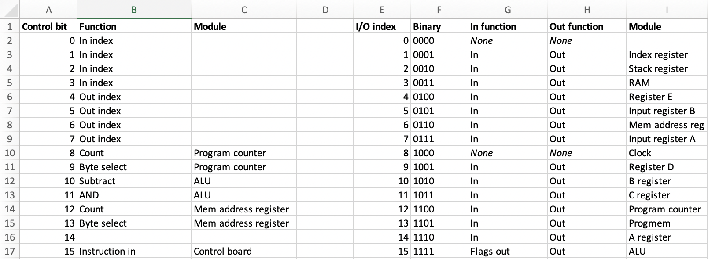

## Design images
### Schematics
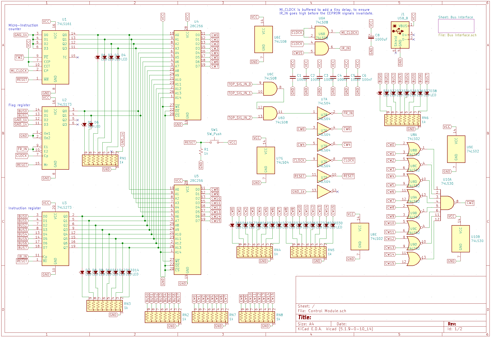
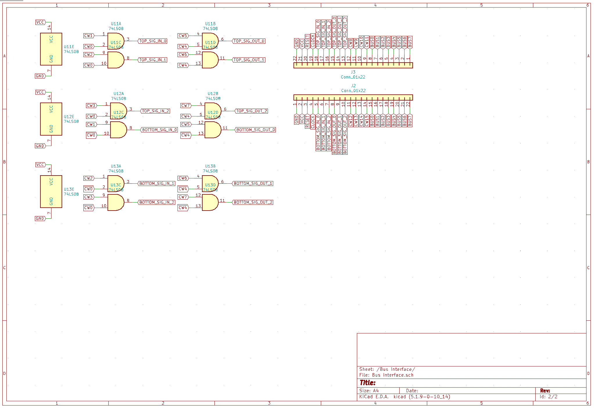

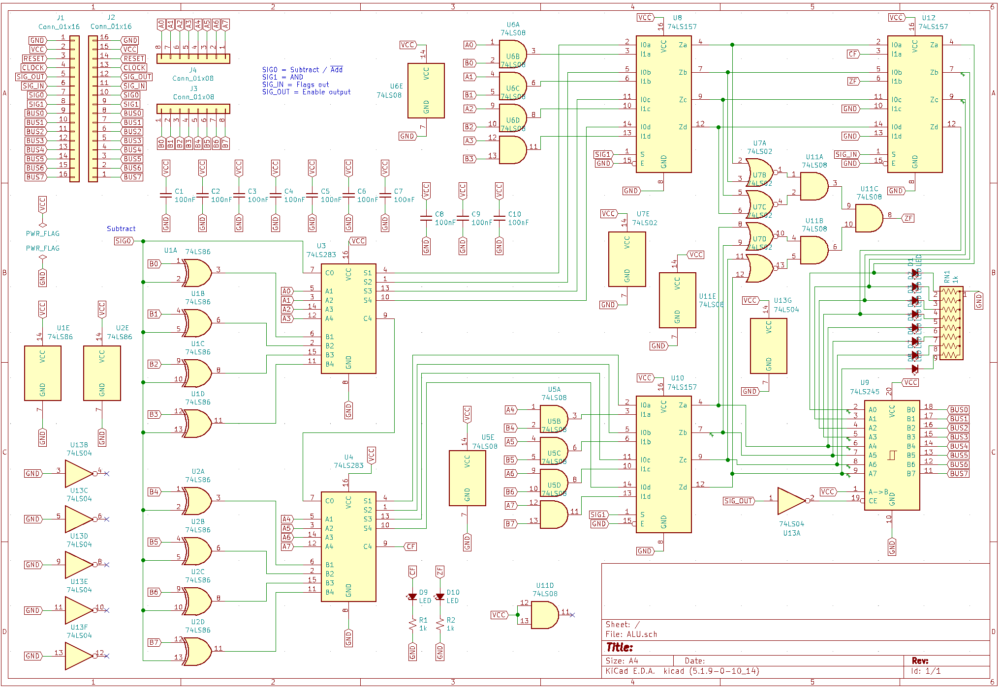

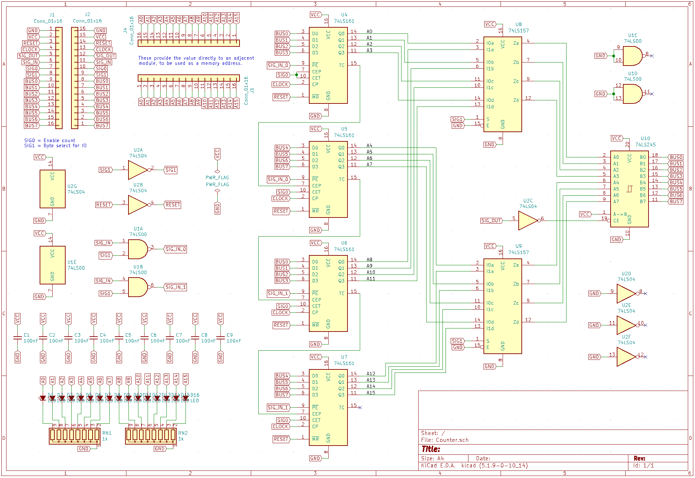

### PCB Layouts
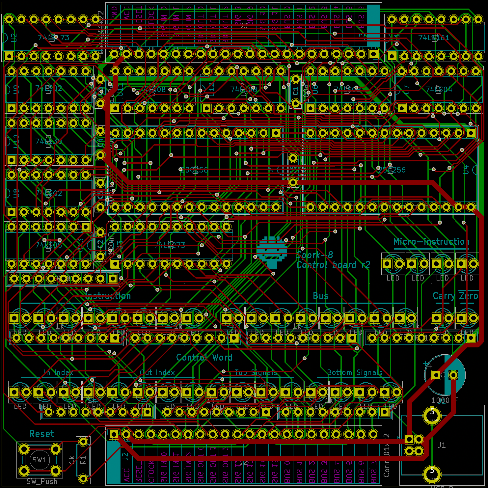
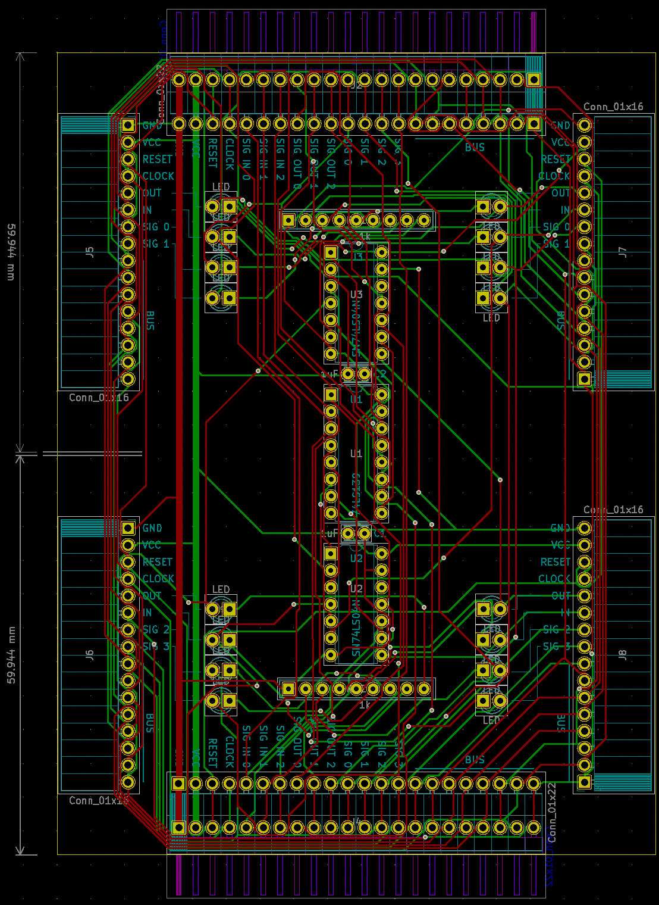
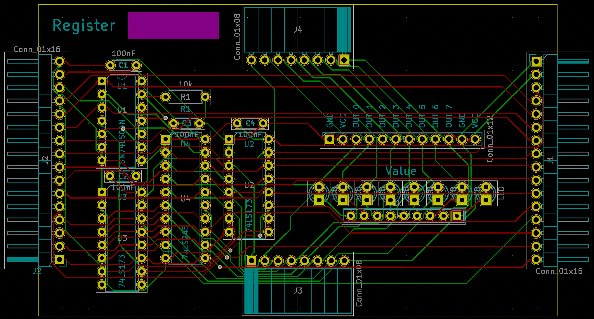
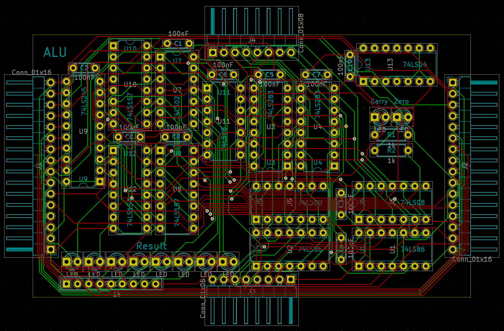
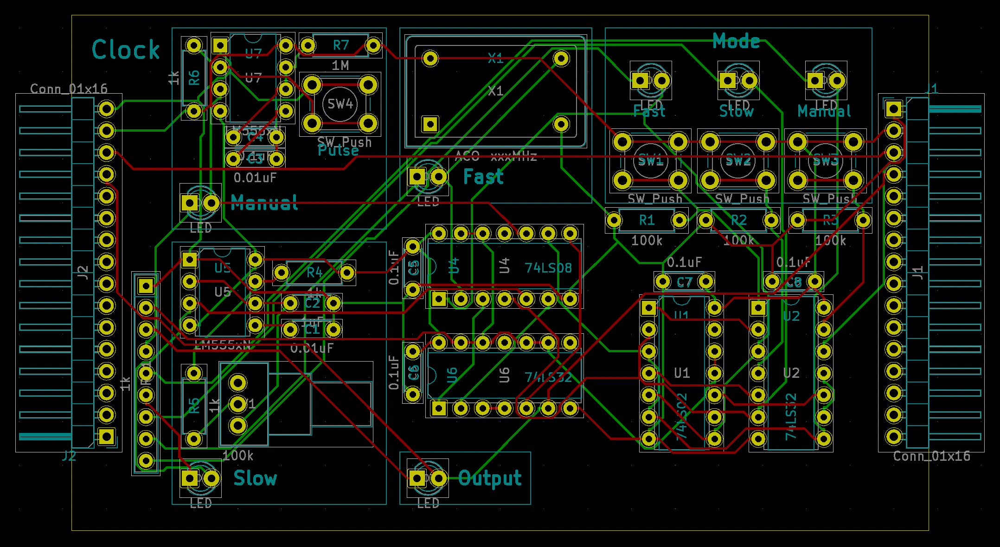
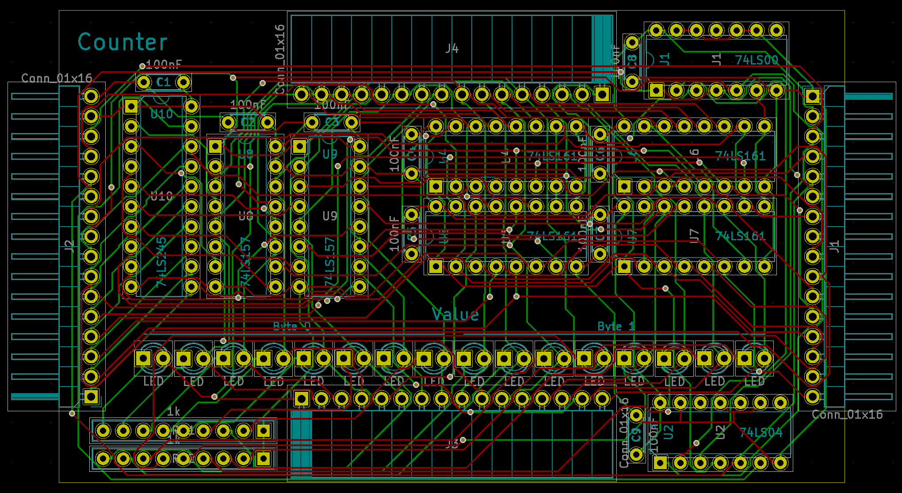

### 3D Renderings

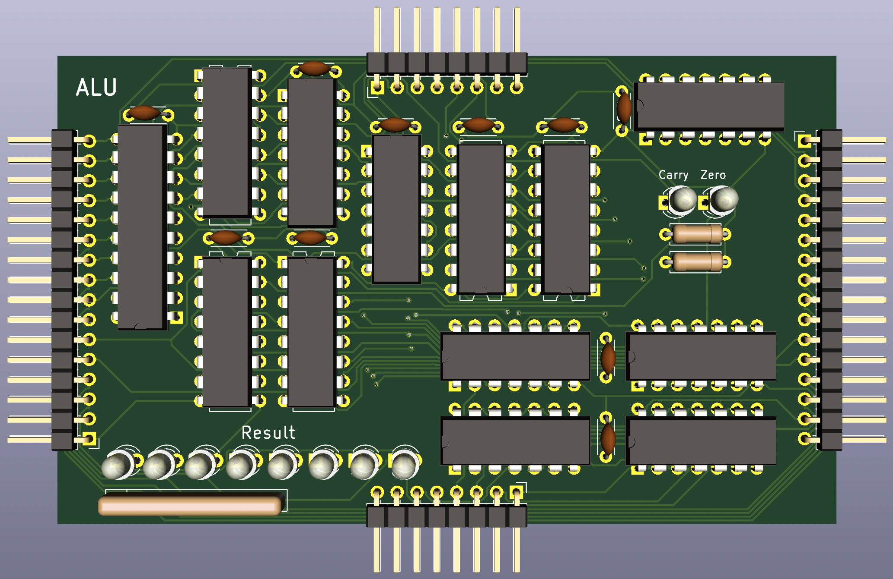

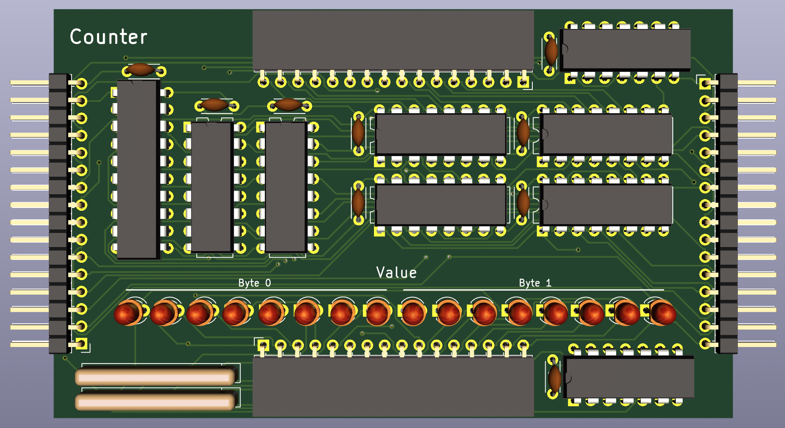
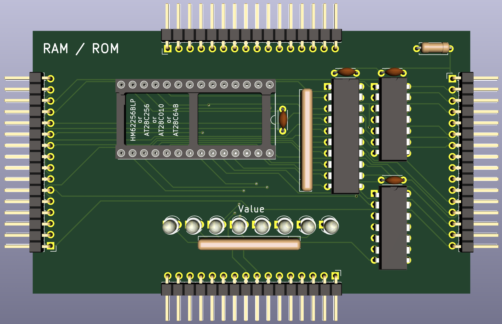

